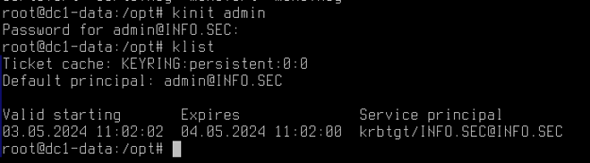

## Делаем..


Этот пункт задания можно сделать как в Apache2, так и в NGINX. 

Мы рассмотрим вариант через Apache2.

Для начала подготовим конфигурацию через протокол HTTP.

Идем в файл - /etc/apache2/sites-enabled/000-default.conf

Удаляем все лишнее, и приводим файл к виду:

```<VirtualHost *:80>
    ServerName www.datacenter.mgmt
    DocumentRoot /opt/data
    <Directory /opt/data>
        AuthType Basic
        Options Indexes FollowSymLinks
        AuthUserFile /etc/apache2/.htpasswd
        AuthName "Authorization"
        Require valid-user
    </Directory>

    ErrorLog ${APACHE_LOG_DIR}/error.log
    CustomLog ${APACHE_LOG_DIR}/access.log combined
</VirtualHost>
```

Готово! Теперь можно сайт проверить, откуда-нибудь с PC1.


## Далее работа в веб интерфейсе


Заполните форму, как на примере


После этого, удобнее всего будет подключиться по SSH к dc1-data с PC1, и получить керберос-ключ для администратора домена.



Далее, необходимо привязать службу HTTP к хосту в домене, лучше всего в нашем случае будет привязать её к доменному контроллеру командой –

`ipa service-add-host –hosts=dc1-data.info.sec HTTP/www.datacenter.mgmt`

ipa-getcert request -r -f /opt/cert1.crt -k /opt/cert1.key -N CN=www.info.sec -D www.info.sec -K HTTP/www.info.sec
